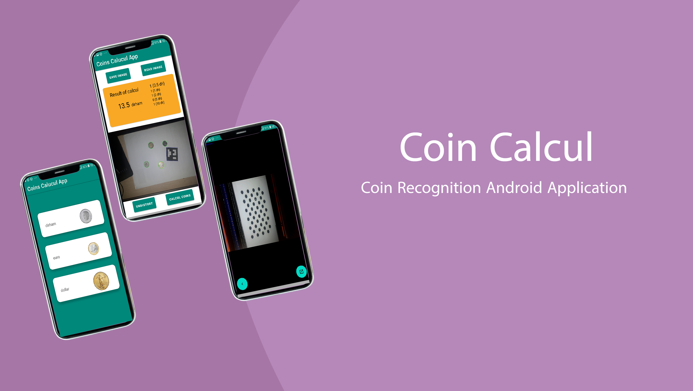

# Coin Recognition Android Application

This Android application utilizes computer vision techniques to recognize and classify different coins, simplifying the process of sorting and counting them in commercial or domestic contexts. By leveraging image processing techniques such as segmentation, contour detection, and feature extraction, the application can accurately identify coins based on their visual characteristics.

## Features

- Coin recognition and classification using computer vision
- Simple and intuitive user interface
- Capture or choose a photo of coins
- Automatic calculation of the total value of detected coins

## Technologies and Tools Used

- Kotlin: The main programming language used for the application development.
- C++: Utilized for implementing the image processing algorithms and achieving efficient coin recognition.
- OpenCV: Computer vision library used for various image processing tasks.
- JNI (Java Native Interface): Enabled the execution of C++ code within the Android application.
- CMake, NDK, Ninja: Tools used for generating the static libraries (.a) of the OpenCV SDK, allowing the integration of C++ code in the application.

## Getting Started

To get started with the application, follow these steps:

1. Clone the repository: `git clone https://github.com/portmaler/coins-calcul.git`
2. Open the project in Android Studio.
3. Build and run the application on your Android device or emulator.
4. Follow the on-screen instructions to capture or choose a photo of coins for recognition.

## License

This project is licensed under the [MIT License](./LICENCE).

## Contributing

If you've found an error in the project, please file an issue.

Patches are encouraged and may be submitted by forking this project and submitting a pull request. Since this project is still in its very early stages, if your change is substantial, please raise an issue first to discuss it.

